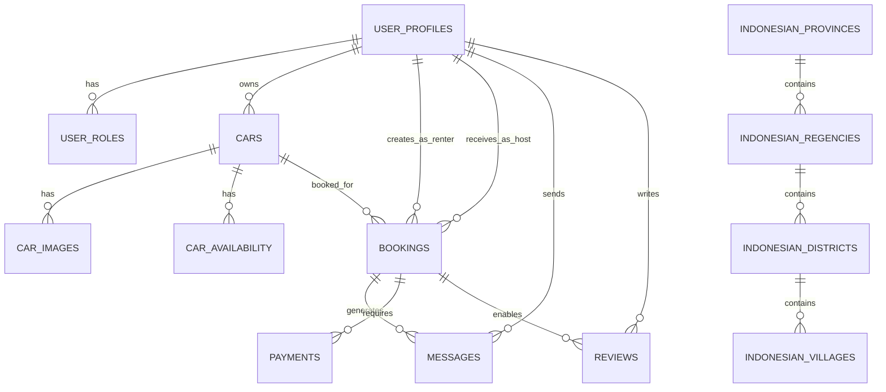

# REBIL - System Design Architecture

## Overview

REBIL is a peer-to-peer car rental platform built with Next.js 15, Supabase, and modern React patterns. This document outlines the comprehensive system architecture, component design, and API specifications.

## System Architecture

### 🏗️ High-Level Architecture

```
┌─────────────────────────────────────────────────────────────┐
│                     Frontend Layer                          │
├─────────────────────────────────────────────────────────────┤
│ Next.js 15 App Router │ React 19 │ TailwindCSS │ TypeScript │
├─────────────────────────────────────────────────────────────┤
│                   Component Layer                           │
├─────────────────────────────────────────────────────────────┤
│ Feature Components │ UI Components │ Layout Components      │
├─────────────────────────────────────────────────────────────┤
│                    Service Layer                            │
├─────────────────────────────────────────────────────────────┤
│ React Query │ Supabase Client │ Performance Monitor │ i18n  │
├─────────────────────────────────────────────────────────────┤
│                      API Layer                              │
├─────────────────────────────────────────────────────────────┤
│ Next.js API Routes │ Middleware │ Auth Guards               │
├─────────────────────────────────────────────────────────────┤
│                   Database Layer                            │
├─────────────────────────────────────────────────────────────┤
│              Supabase PostgreSQL Database                   │
└─────────────────────────────────────────────────────────────┘
```

### 🎯 Core Domains

1. **User Management**: Authentication, profiles, roles, verification
2. **Vehicle Management**: Car listings, availability, images, approval workflow
3. **Booking Engine**: Reservations, availability checking, business rules
4. **Messaging System**: Real-time communication between hosts and renters
5. **Payment Processing**: Payments, deposits, refunds via Stripe integration
6. **Review System**: Bidirectional reviews for hosts and renters
7. **Location Services**: Indonesian administrative hierarchy integration
8. **Admin Dashboard**: Vehicle approvals, user management, analytics

## Database Schema Design

### 📊 Entity Relationship Overview



### 🔑 Key Design Principles

- **Single Source of Truth**: Each entity has a primary table with foreign key relationships
- **Audit Trail**: All tables include `created_at` and `updated_at` timestamps
- **Soft Deletes**: Status-based deletion using enums (ACTIVE/INACTIVE/SUSPENDED)
- **Type Safety**: Strong typing with TypeScript-generated types from Supabase
- **Normalization**: Proper 3NF normalization with denormalized stats tables for performance

## Component Architecture

### 📁 Directory Structure

```
src/
├── app/                    # Next.js App Router
│   ├── (auth)/            # Authentication pages
│   ├── (protected)/       # Authenticated pages
│   ├── api/               # API route handlers
│   └── globals.css        # Global styles
├── components/            # Reusable components
│   ├── address/           # Address input components
│   ├── admin/             # Admin-specific components
│   ├── base/              # Base layout components
│   ├── host/              # Host dashboard components
│   ├── maps/              # Google Maps integration
│   ├── messages/          # Messaging system
│   ├── monitoring/        # Performance monitoring
│   ├── providers/         # React context providers
│   ├── renter/            # Renter-specific components
│   ├── reviews/           # Review system components
│   ├── search/            # Vehicle search components
│   ├── ui/                # Base UI components
│   └── vehicles/          # Vehicle management
├── hooks/                 # Custom React hooks
│   ├── cached/            # React Query cached hooks
│   └── [feature]Hooks.ts  # Feature-specific hooks
├── lib/                   # Utility libraries
│   ├── auth/              # Authentication utilities
│   ├── cache/             # Caching strategies
│   ├── i18n/              # Internationalization
│   ├── monitoring/        # Performance monitoring
│   ├── notifications/     # Notification system
│   ├── supabase/          # Database clients
│   └── utils/             # General utilities
├── types/                 # TypeScript type definitions
└── middleware.ts          # Next.js middleware
```

### 🧩 Component Design Patterns

#### 1. Container/Presentation Pattern
```typescript
// Container Component (Logic)
export function VehicleSearchContainer() {
    const { vehicles, isLoading, error } = useVehicles();
    const [filters, setFilters] = useState<SearchFilters>({});

    return (
        <VehicleSearchPresentation
            vehicles={vehicles}
            isLoading={isLoading}
            error={error}
            filters={filters}
            onFiltersChange={setFilters}
        />
    );
}

// Presentation Component (UI)
export function VehicleSearchPresentation({
    vehicles,
    isLoading,
    error,
    filters,
    onFiltersChange
}: Props) {
    return (
        <div>
            <SearchFilters filters={filters} onChange={onFiltersChange} />
            <VehicleGrid vehicles={vehicles} loading={isLoading} />
        </div>
    );
}
```

#### 2. Compound Components Pattern
```typescript
// Compound component for complex UI
export const MessageThread = {
    Container: MessageThreadContainer,
    Header: MessageThreadHeader,
    Messages: MessageList,
    Input: MessageInput,
};

// Usage
<MessageThread.Container bookingId={bookingId}>
    <MessageThread.Header />
    <MessageThread.Messages />
    <MessageThread.Input />
</MessageThread.Container>
```

#### 3. Custom Hooks Pattern
```typescript
// Data fetching hook
export function useVehicles(filters?: SearchFilters) {
    return useQuery({
        queryKey: ['vehicles', filters],
        queryFn: () => fetchVehicles(filters),
        staleTime: 5 * 60 * 1000, // 5 minutes
    });
}

// Business logic hook
export function useBookingFlow() {
    const createBooking = useMutation({
        mutationFn: createBookingApi,
        onSuccess: (data) => {
            // Handle successful booking
        },
    });

    return { createBooking };
}
```

## API Design Specifications

### 🔗 REST API Architecture

#### Base URL Structure
```
/api/[resource]/[action]
```

#### Authentication Middleware
```typescript
// Middleware for protected routes
export async function authMiddleware(request: Request) {
    const supabase = createApiClientWithAuth(request);
    const { data: { user }, error } = await supabase.auth.getUser();

    if (error || !user) {
        return new Response('Unauthorized', { status: 401 });
    }

    return user;
}
```

### 📡 API Endpoints

#### Vehicle Search
```typescript
GET /api/vehicles/search
Query Parameters:
- location: string (lat,lng or city name)
- startDate: ISO string
- endDate: ISO string
- filters: JSON object
- page: number
- limit: number

Response:
{
    vehicles: Vehicle[],
    pagination: {
        page: number,
        limit: number,
        total: number,
        hasMore: boolean
    },
    filters: AppliedFilters
}
```

#### Booking Management
```typescript
POST /api/bookings
Body: {
    carId: string,
    startDate: string,
    endDate: string,
    insuranceType: 'BASIC' | 'STANDARD' | 'PREMIUM',
    pickupLocation?: Location,
    dropoffLocation?: Location,
    specialInstructions?: string
}

Response: {
    bookingId: string,
    status: BookingStatus,
    approvalType: 'AUTO' | 'MANUAL',
    message: string,
    estimatedApprovalTime?: number
}
```

#### Messaging System
```typescript
POST /api/messages
Body: {
    bookingId: string,
    receiverId: string,
    message: string
}

GET /api/messages/conversations
Response: {
    conversations: Array<{
        bookingId: string,
        otherUserId: string,
        otherUserName: string,
        vehicleName: string,
        lastMessage: string,
        lastMessageAt: string,
        unreadCount: number,
        bookingStatus: BookingStatus
    }>
}
```

#### Indonesian Location Data
```typescript
GET /api/indonesian-data/provinces
Response: Province[]

GET /api/indonesian-data/regencies?province=<code>
Response: Regency[]

GET /api/indonesian-data/districts?regency=<code>
Response: District[]

GET /api/indonesian-data/villages?district=<code>
Response: Village[]
```

### 🔐 Security Design

#### Authentication Flow
1. **OAuth Integration**: Google OAuth via Supabase Auth
2. **Session Management**: HTTP-only cookies with secure flags
3. **Role-Based Access Control**: Multi-role system (ADMIN, HOST, RENTER)
4. **API Protection**: Middleware-based authentication for all protected routes

#### Data Validation
```typescript
// Input validation using Zod
const BookingSchema = z.object({
    carId: z.string().uuid(),
    startDate: z.string().datetime(),
    endDate: z.string().datetime(),
    insuranceType: z.enum(['BASIC', 'STANDARD', 'PREMIUM']),
});

export async function validateBookingInput(body: unknown) {
    return BookingSchema.safeParse(body);
}
```

## Performance Architecture

### ⚡ Optimization Strategies

#### 1. Caching Layer
```typescript
// React Query configuration
const queryClient = new QueryClient({
    defaultOptions: {
        queries: {
            staleTime: 5 * 60 * 1000, // 5 minutes
            cacheTime: 10 * 60 * 1000, // 10 minutes
            retry: 3,
            refetchOnWindowFocus: false,
        },
    },
});

// Cache invalidation strategies
export function useBookingMutations() {
    const queryClient = useQueryClient();

    return useMutation({
        mutationFn: createBooking,
        onSuccess: () => {
            queryClient.invalidateQueries(['bookings']);
            queryClient.invalidateQueries(['vehicles']);
        },
    });
}
```

#### 2. Database Optimization
- **Indexed Queries**: Strategic indexes on frequently queried columns
- **Materialized Views**: Pre-computed stats tables for dashboard performance
- **Connection Pooling**: Supabase-managed connection pooling
- **Query Optimization**: Custom Postgres functions for complex operations

#### 3. Frontend Optimization
- **Code Splitting**: Dynamic imports for route-based splitting
- **Image Optimization**: Next.js Image component with responsive images
- **Bundle Analysis**: Regular bundle size monitoring
- **Progressive Loading**: Skeleton screens and lazy loading

### 📊 Monitoring & Analytics

#### Performance Monitoring
```typescript
// Custom performance monitoring hook
export function usePerformanceMonitoring() {
    const [metrics, setMetrics] = useState<PerformanceMetrics>();

    useEffect(() => {
        const observer = new PerformanceObserver((list) => {
            const entries = list.getEntries();
            // Process and store metrics
        });

        observer.observe({ entryTypes: ['navigation', 'resource'] });

        return () => observer.disconnect();
    }, []);

    return metrics;
}
```

## Internationalization Design

### 🌍 Multi-Language Support

#### Language Configuration
```typescript
// i18n configuration
export const i18nConfig = {
    defaultLocale: 'en',
    locales: ['en', 'id', 'ko'],
    fallbackLocale: 'en',
    reloadOnPrerender: false,
};

// Translation hook
export function useTranslation(namespace?: string) {
    const { i18n, t } = useI18next();

    return {
        t: (key: string, options?: any) => t(key, options),
        language: i18n.language,
        changeLanguage: i18n.changeLanguage,
    };
}
```

#### Content Structure
```
locales/
├── en/
│   ├── common.json      # Common UI elements
│   ├── auth.json        # Authentication flows
│   ├── booking.json     # Booking process
│   ├── vehicle.json     # Vehicle listings
│   └── messages.json    # Messaging system
├── id/                  # Indonesian translations
└── ko/                  # Korean translations
```

## Error Handling & Resilience

### 🛡️ Error Management Strategy

#### API Error Handling
```typescript
// Centralized error handling
export class ApiError extends Error {
    constructor(
        public statusCode: number,
        public code: string,
        message: string,
        public details?: any
    ) {
        super(message);
    }
}

export function handleApiError(error: unknown): Response {
    if (error instanceof ApiError) {
        return new Response(JSON.stringify({
            error: error.code,
            message: error.message,
            details: error.details,
        }), {
            status: error.statusCode,
            headers: { 'Content-Type': 'application/json' },
        });
    }

    // Log unexpected errors
    console.error('Unexpected API error:', error);

    return new Response('Internal Server Error', { status: 500 });
}
```

#### React Error Boundaries
```typescript
// Error boundary for component tree protection
export class ErrorBoundary extends Component<Props, State> {
    constructor(props: Props) {
        super(props);
        this.state = { hasError: false, error: null };
    }

    static getDerivedStateFromError(error: Error): State {
        return { hasError: true, error };
    }

    componentDidCatch(error: Error, errorInfo: ErrorInfo) {
        // Log to monitoring service
        reportError(error, errorInfo);
    }

    render() {
        if (this.state.hasError) {
            return <ErrorFallback error={this.state.error} />;
        }

        return this.props.children;
    }
}
```

## Future Architectural Considerations

### 🚀 Scalability Roadmap

1. **Microservices Migration**: Gradual extraction of services (payments, notifications)
2. **CDN Integration**: Global content delivery for static assets
3. **Real-time Features**: WebSocket integration for live messaging
4. **Mobile Applications**: React Native app using shared API layer
5. **AI/ML Integration**: Recommendation engine and fraud detection
6. **Multi-tenant Architecture**: Support for multiple regions/countries

### 📈 Performance Targets

- **Page Load Time**: < 3 seconds on 3G networks
- **API Response Time**: < 500ms for 95th percentile
- **Database Query Time**: < 100ms for standard operations
- **Search Response**: < 2 seconds for complex location-based queries
- **Real-time Messaging**: < 200ms latency for message delivery

---

*This design document serves as the architectural blueprint for REBIL's continued development and scaling efforts.*